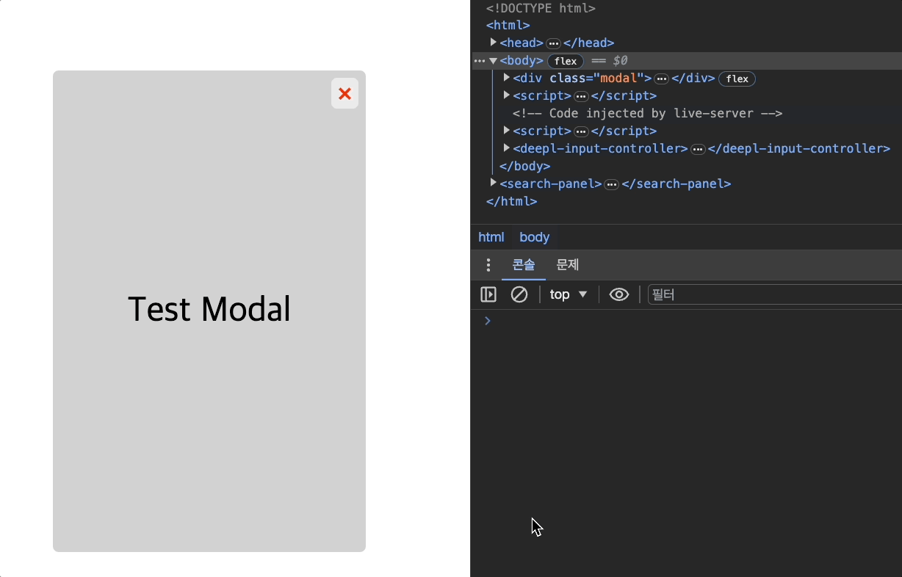
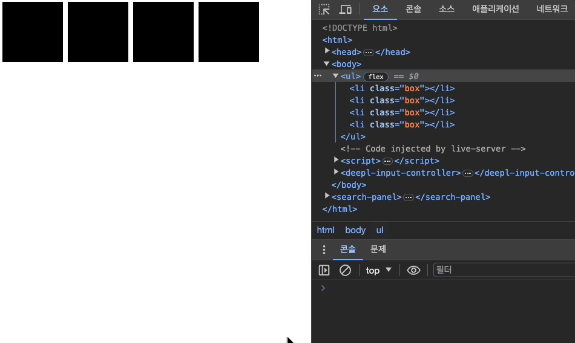

# 🎬 Animation-utils

애니메이션 유틸 메서드

---

## 🫥 Element: fadeOut() method

서서히 사라지면서 해당 `Element` 요소를 제거합니다.

```javascript
/**
 *
 * @param {number | string} time - fadeOut 진행 시간
 * @param {{ease?: 'ease-in' | 'ease-out' | 'ease-in-out', delay?: number, checkState?: boolean}} options - {ease: 가속도, delay: 지연 시간, checkState: 시작/종료 상태 확인 }
 * @returns {Promise<Element | null>}
 */
Element.fadeOut(time [, options]);

```

```javascript
Element.fadeOut(time?: number | string,
  options?: { ease?: 'ease-in' | 'ease-out' | 'ease-in-out', delay?: number, checkState?: boolean }
): Promise<Element | null>;
```

### #1 Demo

```javascript
// 사용 예시
import './fadeOut.js';

const modal = document.querySelector('.modal');

- modal.fadeOut();
- modal.fadeOut(0.5);
- modal.fadeOut(0.8, { ease: 'ease-in' });
- modal.fadeOut(1, { ease: 'ease-in-out', delay: 1, checkState: true });
```



### #2 Demo

```javascript
// 사용 예시
import './fadeOut.js';

const boxes = Array.from(document.querySelectorAll('.box')).reverse();

boxes.forEach((el, i) => el.fadeOut(0.6 * (i + 1), { ease: 'ease-in-out', checkState: true }));
```



---
